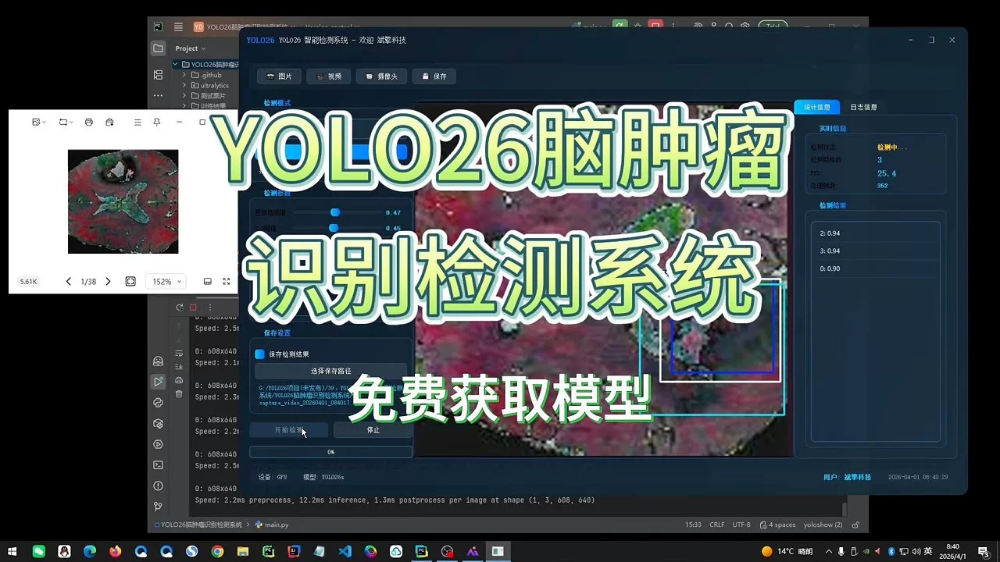
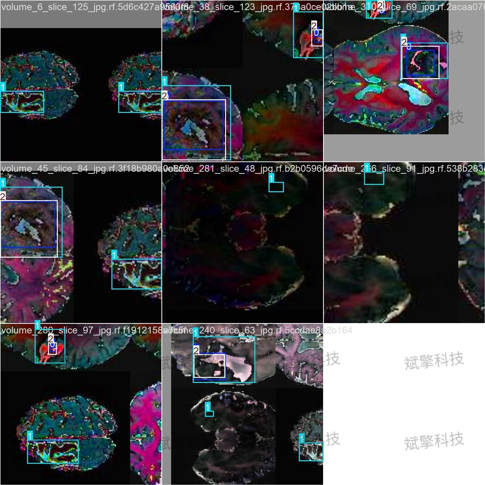
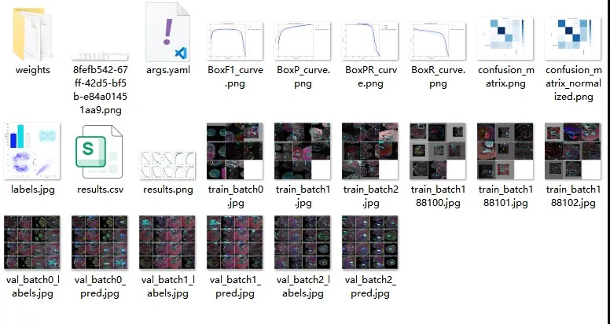
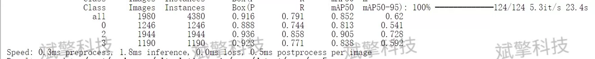
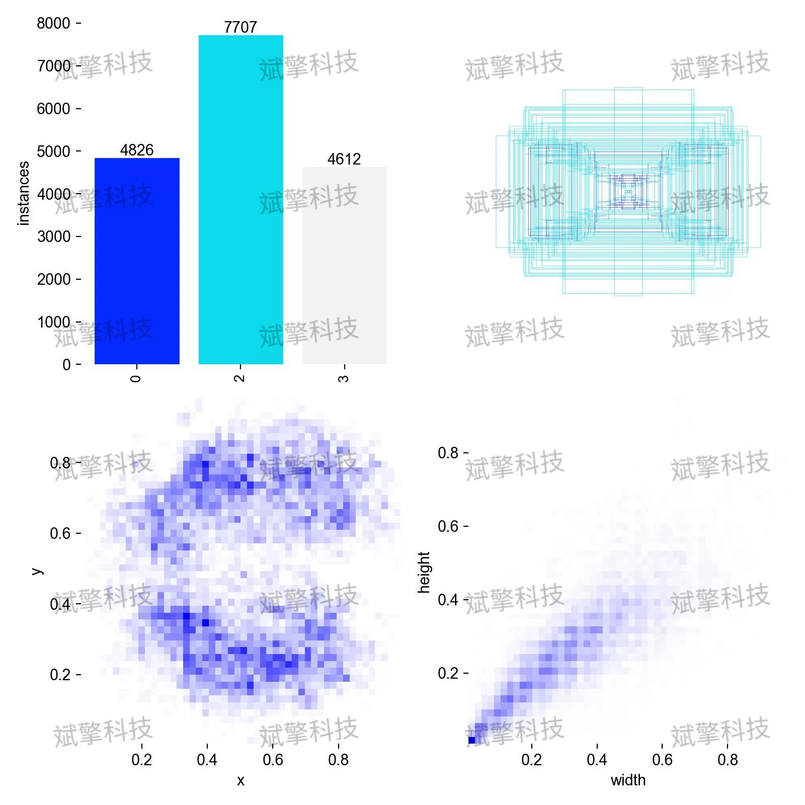
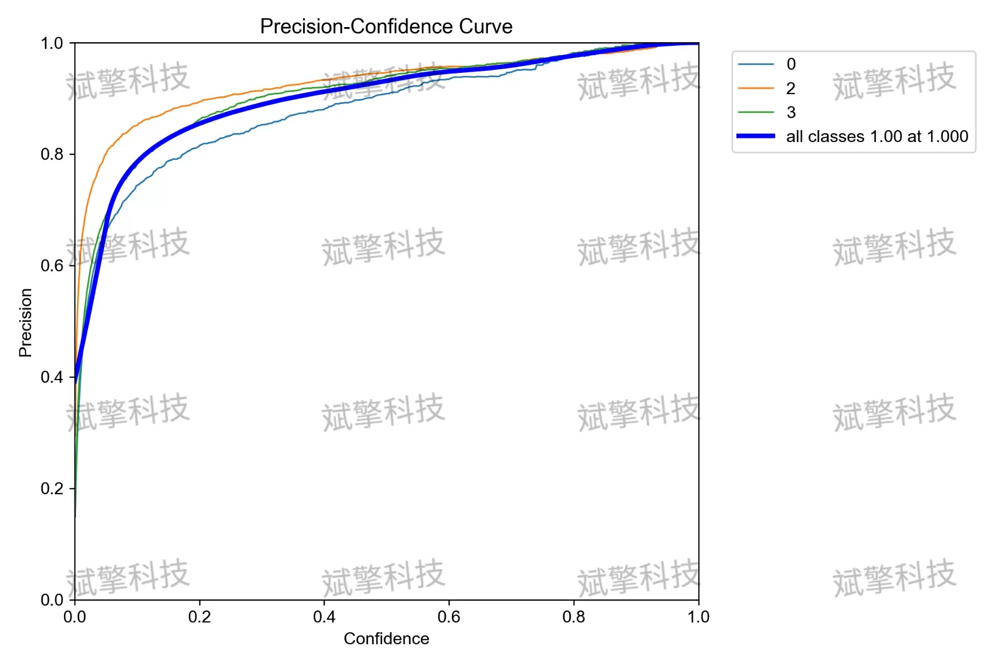
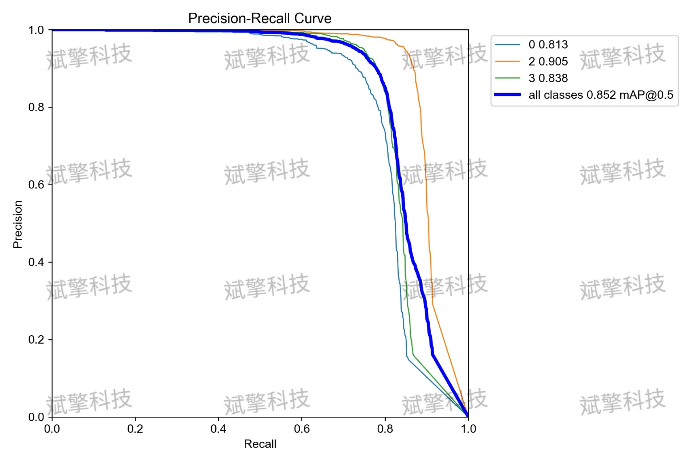
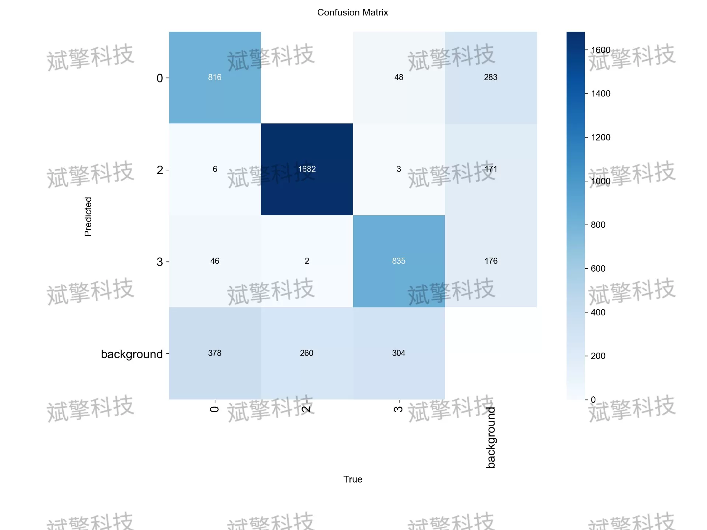
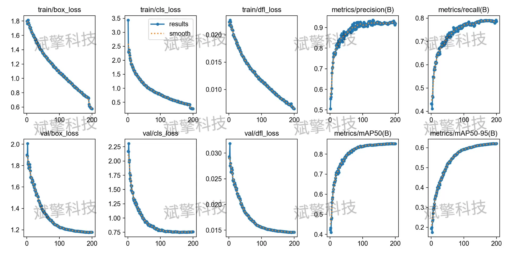

# YOLOv26 Brain Tumor Detection System | Model + Dataset

## Body

YOLO26 Brain Tumor Identification System | Model + Dataset Based on the Latest YOLO26 Architecture for Brain Tumor Identification, Including 7920 Training Images (Project Source Code + Dataset + Model Weights + UI Interface + Python + Deep Learning + Remote Deployment)

This study proposes a brain tumor intelligent recognition and detection system based on the YOLO26 deep learning architecture, aiming to enhance the efficiency and accuracy of medical image diagnosis through automated image analysis techniques. The system is designed to identify three types of brain tumors (category "0","2","3") with fine-grained recognition. The experimental dataset includes 7920 training images and 1980 validation images, and after thorough training, the model demonstrates outstanding performance on the validation set. Specifically, the average precision mean (mAP@50) reached 85.2%, with category "2" performing particularly well, achieving an mAP of 90.5% and a recall rate and precision both exceeding 85%. Additionally, the system's inference speed reaches about 43 frames per second (FPS), meeting the needs of real-time assisted diagnosis in clinical settings. This study indicates that the YOLO26 model can effectively differentiate between different types of brain tumors, demonstrating high potential for clinical application.

The dataset used in this study has been rigorously screened and labeled to comprehensively cover samples of brain tumors of different shapes and positions, ensuring sufficient training and robustness of the model.
Data scale: The dataset consists of a total of 9900 high-quality brain medical imaging slices.
Training set: Includes 7920 images for model parameter learning and weight update.
Validation set: Includes 1980 images for monitoring model performance during training, adjusting hyperparameters to prevent overfitting.
Classification definition: The dataset contains three target detection categories, labeled as "0","2","3", representing different types of brain tumor lesions. In addition, the dataset also includes a background category for distinguishing normal brain tissue from lesion areas.

Free appointment for remote installation. Unsuccessful installation will result in full refund.
Purchase comes with the following resources (auto-unlocked in Baidu Cloud):
   - YOLO identification detection project complete source code
   - YOLO format dataset
   - Training code + UI interface code
   - Trained model + results images
   - Software installer
   - Add WeChat for remote installation (automatically displayed WeChat ID after purchase) - Unsuccessful, full refund

⚙️ Core functionality modules
Detection capabilities
    Image detection: upload and detect, returning detection boxes + category information
    Video detection: supports video files, analyzing accurately frame by frame
    Camera real-time detection: connects to USB camera, achieving dynamic monitoring
Interaction and control
    Target selection: freely choose one or more categories for detection
    Parameter adjustment: adjustable confidence threshold & IoU threshold, flexible control of precision
    Result saving: save images/videos/camera detection results in one click
System and data
    User login registration: Supports password strength check + encryption storage
    Log recording: automatically records operation and error information (timestamped)

## Images

## Payment

Here is a pay link on Stripe ( https://buy.stripe.com/3cs8yP7sY87d0vu9AB ). Please contact me lonlonago@foxmail.com after funding $89, and I will send you a complete data files , thank you!

